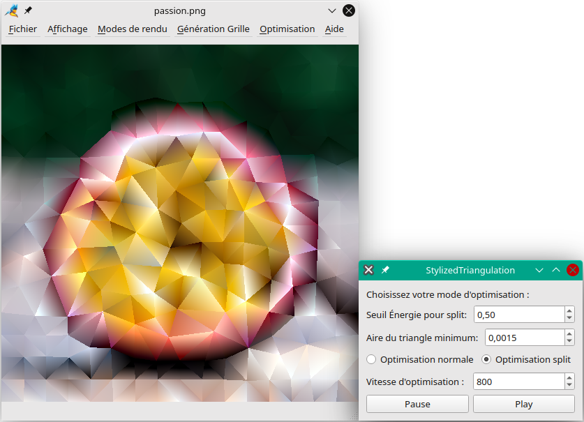

# Stylized Image Triangulation

  

An application to automatically generate abstract triangulated images with several methods to generate and render these triangles  [[1]](#1) [[2]](#2) [[3]](#3) [[4]](#4).

## Examples of output

  
  

## References
<a id="1">[1]</a> 
Lawonn, K., & Günther, T. (2019, February). Stylized image triangulation. In Computer graphics forum (Vol. 38, No. 1, pp. 221-234).

<a id="2">[2]</a> 
Xu, L., Lu, C., Xu, Y., & Jia, J. (2011, December). Image smoothing via L 0 gradient minimization. In Proceedings of the 2011 SIGGRAPH Asia conference (pp. 1-12).

<a id="3">[3]</a> 
Botsch, M., & Kobbelt, L. (2004, July). A remeshing approach to multiresolution modeling. In Proceedings of the 2004 Eurographics/ACM SIGGRAPH symposium on Geometry processing (pp. 185-192).

<a id="4">[4]</a> 
Hou, X., Harel, J., & Koch, C. (2011). Image signature: Highlighting sparse salient regions. IEEE transactions on pattern analysis and machine intelligence, 34(1), 194-201.
